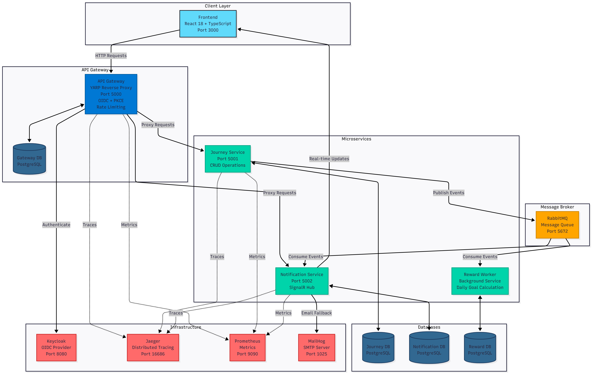
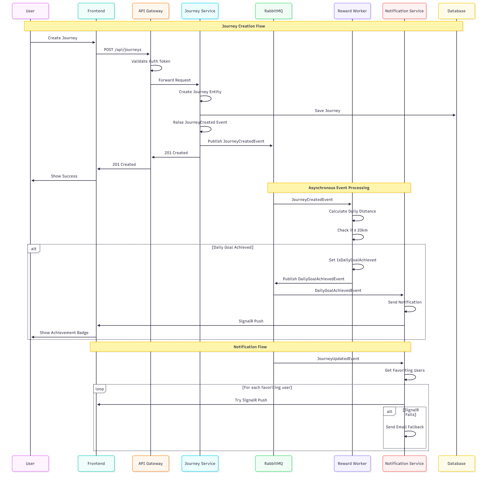

# NavPlat - Navigation Platform

A microservices-based navigation platform where users can record, manage, and share their journeys.

## 📊 Code Coverage


## 🚀 Quick Start

### One-Command Startup

```bash
docker compose up
```

This starts the entire stack:
- API Gateway (port 5000)
- Journey Service (port 5001)
- Notification Service (port 5002)
- Reward Worker (background)
- Frontend (port 3000)
- PostgreSQL, RabbitMQ, Keycloak, Jaeger, Prometheus, MailHog

Access the application at http://localhost:3000

## 📚 API Documentation

The complete API specification is available in OpenAPI 3.0 format:

- **OpenAPI Specification**: [`docs/openapi.yaml`](docs/openapi.yaml)

The OpenAPI spec includes:
- All authentication endpoints (`/auth/*`)
- Journey management endpoints (`/journeys/*`)
- Notification endpoints (`/notifications/*`)
- Admin endpoints (`/admin/*`)
- Request/response schemas
- Authentication requirements

## 📐 Architecture

### Architecture Diagram



### Message Flow



## 🏗️ Design Decisions & Trade-offs

### Microservices Architecture

**Decision**: Microservices with independent databases per service

**Rationale**:
- Each service owns its data (data isolation)
- Independent scaling (e.g., Reward Worker can scale separately)
- Clear bounded contexts

**Trade-offs**:

**Pros:**
- Better scalability and independent deployment
- Clear service boundaries

**Cons:**
- More operational complexity
- Network latency between services
- Distributed transaction challenges (solved with eventual consistency)

### Event-Driven Communication

**Decision**: Asynchronous messaging with RabbitMQ

**Rationale**:
- Loose coupling between services
- Better resilience (services can be temporarily unavailable)
- Scalability (workers can be scaled independently)

**Trade-offs**:

**Pros:**
- Decoupled services
- Better fault tolerance

**Cons:**
- Eventual consistency (acceptable for this domain)
- More complex debugging (solved with distributed tracing)

### Outbox Pattern

**Decision**: Store domain events in outbox table before publishing

**Rationale**:
- Ensures at-least-once delivery
- Prevents data loss if message broker is down
- Guarantees transactional consistency

**Trade-offs**:

**Pros:**
- Reliable event delivery
- No data loss

**Cons:**
- Additional complexity (background publisher service)

### Clean Architecture

**Decision**: Domain → Application → Infrastructure → Presentation layers

**Rationale**:
- Domain logic independent of infrastructure
- Testability (domain logic can be unit tested without DB)
- Maintainability (clear separation of concerns)

**Trade-offs**:

**Pros:**
- Testable and maintainable
- Technology-agnostic domain

**Cons:**
- More boilerplate code
- Steeper learning curve

### OIDC with PKCE

**Decision**: Authorization Code Flow with PKCE

**Rationale**:
- Security best practice for SPAs
- Prevents authorization code interception
- Industry standard (OAuth 2.1 requirement)

**Trade-offs**:

**Pros:**
- More secure than implicit flow
- Works well with SPAs

**Cons:**
- Slightly more complex implementation

## 📈 Production Scaling Strategy

### Horizontal Scaling

All services are stateless and can be horizontally scaled:

```bash
# Scale Journey Service
docker compose up --scale journey-api=3

# Scale Reward Workers
docker compose up --scale reward-worker=5
```

### Database Scaling

**Current**: Single PostgreSQL instance per service

**Production Strategy**:
1. **Read Replicas**: Add read replicas for read-heavy queries
2. **Connection Pooling**: Use PgBouncer or similar
3. **Partitioning**: Partition large tables (e.g., journeys by date)
4. **Caching**: Redis for frequently accessed data

### Message Queue Scaling

**Current**: Single RabbitMQ instance

**Production Strategy**:
1. **RabbitMQ Cluster**: Multi-node cluster for high availability
2. **Queue Sharding**: Shard queues by user ID or region
3. **Dead Letter Queues**: Handle failed messages gracefully

### Frontend Scaling

**Current**: Single NGINX container

**Production Strategy**:
1. **CDN**: Serve static assets via CDN (CloudFlare, AWS CloudFront)
2. **Multiple Instances**: Load balance across multiple NGINX instances
3. **Caching**: Aggressive caching of static assets

### Deployment Strategy

**Recommended**: Kubernetes

1. **Deployments**: Use Kubernetes Deployments for rolling updates
2. **Services**: Kubernetes Services for load balancing
3. **Ingress**: NGINX Ingress Controller for external access
4. **ConfigMaps/Secrets**: Manage configuration securely
5. **Horizontal Pod Autoscaler**: Auto-scale based on CPU/memory

### Example Kubernetes Scaling

```yaml
apiVersion: autoscaling/v2
kind: HorizontalPodAutoscaler
metadata:
  name: journey-api-hpa
spec:
  scaleTargetRef:
    apiVersion: apps/v1
    kind: Deployment
    name: journey-api
  minReplicas: 2
  maxReplicas: 10
  metrics:
  - type: Resource
    resource:
      name: cpu
      target:
        type: Utilization
        averageUtilization: 70
```
